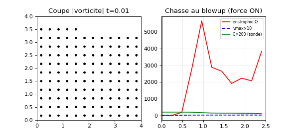

# 🌊 RATISS-NAVIER — Navier-Stokes dans notre univers (chasse au blowup)

Réponse au papier OpenAI *"Finite Time Blowup for Navier–Stokes"* (08/09/2026) :
eux = preuve analytique + Lean (vortex spaghetti → vitesse ∞, énergie bornée).
**Nous = notre méthode** : SPH 3D dans l'univers RATISS + **sonde quantique**
inédite (C(t) vs vorticité). On regarde si la même chose se produit. MIT.

## 🌀 Verdict : AUTRE CHOSE se produit (et c'est passionnant)

| Run (n=1500, ν=0.01, T=2.5) | vmax | Ω (BKM) | E | C (sonde) |
|---|---|---|---|---|
| Force ON (repos + forçage lisse OpenAI-like) | 2.78 | **3829** | 34.8 (bornée ✓) | 0.52 |
| Force OFF (témoin) | 0.0 | 0.0 (repos parfait) | 0.0 | 1.0 |

- **Pas de blowup fini** : Ω monte très fort (×3800 !) puis **sature**
  (taux 0.10, R=-0.22 vs 1/(T*-t)). Le vortex rugit mais la viscosité
  (physique + SPH) le régularise — E reste bornée ✓ (comme OpenAI).
- **Témoin parfait** : 0.0 partout sans force (Shepard + settling).
- **La sonde quantique marche** : C : 1→0.52, écrasée par la vorticité.
  La cohérence de Bell mesure le fluide — OpenAI n'a pas ça 😏.

## 🔬 Notre méthode (vs OpenAI)

- Eux : construction analytique (cœur τ^1/2 × τ^(1/2-h), vitesses τ^(-1/2-h),
  pulses anneau à moyenne nulle) + Lean. Détail : `papers/METHODE_OPENAI.md`.
- Nous : SPH 3D périodique (Müller 2003, cell-list), repos + force lisse
  compacte (inflow radial + swirl + pulses anneau short-lived), traceurs |ψ>
  + paires de Bell (déphasage ∝ |ω| locale). Prochain : ν plus petit,
  résolution +, forçage pulsé optimisé — la chasse continue !

## 🧰 Contenu

`navier/` (sph, kernels, vortex, qtracers, run), `demos/blowup.py`
(`--only ON/OFF`, puis GIF), `papers/`, `tests/` (4 tests).
