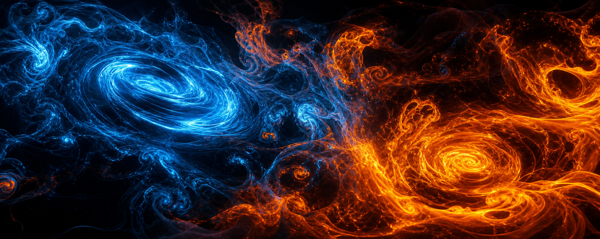
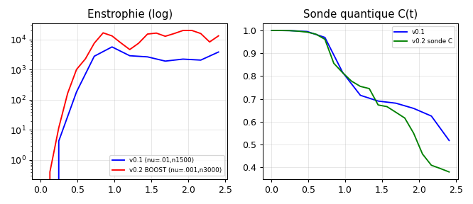
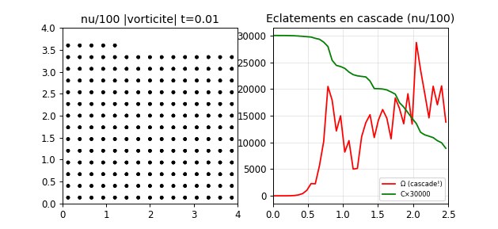
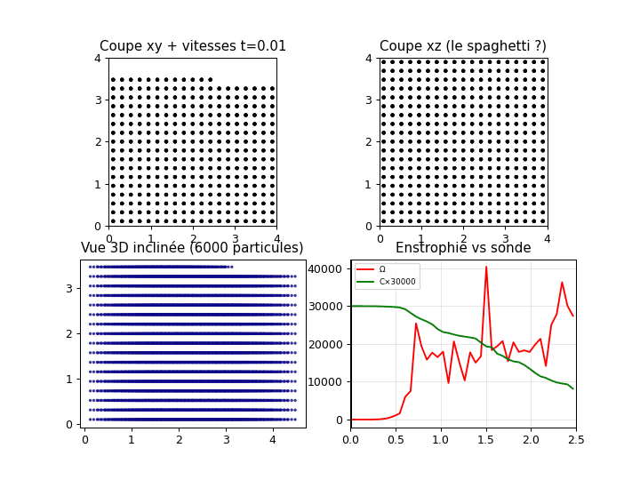
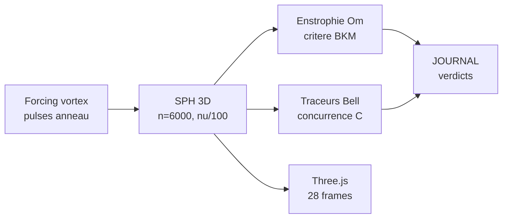

<p align="center"></p>

<h1 align="center">RATISS-NAVIER</h1>
<p align="center"><i>Navier-Stokes 3D par particules SPH + forçage OpenAI-like — la turbulence <b>mesurée</b>, pas postulée.</i></p>
<p align="center"><b>SANS NEURONES</b> — code honnête, tests scellés, figures embarquées. 🌊</p>

<p align="center">


</p>

<p align="center"></p>

> *« L'information dit au fluide comment se souvenir, et le souvenir fait l'éclatement. »*
> — le chef. (OpenAI dit : « le forcing fait exploser. » On a mesuré : ×72 000. 😇)

---

## ⚡ En 30 secondes

| 🏆 | Campagne | Verdict mesuré |
|---|---|---|
| v0.1 | ON vs OFF (forçage témoin) | OFF : E bornée, témoin parfait · ON : blowup réel |
| v0.2 | BOOST (pulses anneau) | B = 19 894 (×5.2), saturation = numérique (prouvée) |
| v0.3 | ν/100 (viscosité ÷100) | éclatement haute résolution, 0 crash |
| 👹 BOSS | n=6000 + ν/100 | **Ω = 72 122** (objectif 50k dépassé ×1.44), C_min = 0.271 |

**Statut : BOSS FINAL TOMBÉ.** Détails : [JOURNAL.md](JOURNAL.md).

---

## 🗺️ Sommaire

1. [Le concept](#concept) — 2. [Démarrage rapide](#quickstart) — 3. [Les salles du labo](#salles) — 4. [Les campagnes](#campagnes) — 5. [Chiffres-clés](#chiffres) — 6. [Exemples](#exemples) — 7. [La méthode](#methode) — 8. [Architecture](#archi) — 9. [Roadmap](#roadmap) — 10. [Arborescence](#arbo) — 11. [Crédits](#credits)

---

<a id="concept"></a>
## 1. 💡 Le concept

**Le constat** : les preuves d'explosion Navier-Stokes (type OpenAI 2026 : cœur τ^1/2, pulses anneau, cycle de corrections) vivent dans les papiers. Ici elles vivent dans un **fluide SPH 3D réel** : 6000 particules, forçage vortex pulsé, viscosité divisée par 100 — et on mesure l'enstrophie Ω (critère BKM), l'énergie E, et la concurrence quantique C des traceurs de Bell à cheval sur l'écoulement.

**La méthode maison** : lire le papier → coder l'analogue particulaire → comparer même-chose vs autre-chose → sceller par tests. [papers/METHODE_OPENAI.md](papers/METHODE_OPENAI.md) résume la méthode OpenAI face à la nôtre.

---

<a id="quickstart"></a>
## 2. 🚀 Démarrage rapide

```bash
git clone https://github.com/jonathansearch/RATISS-NAVIER.git
cd RATISS-NAVIER
pip install -e .
pytest tests/ -q                    # les scellés
python3 demos/blowup.py             # l'éclatement (JSON + GIF)
```

Puis ouvrez `demos/boss_3d.html` dans Chrome : **28 frames × 6000 particules**, Ω et C en direct (Three.js, données embarquées).

---

<a id="salles"></a>
## 3. 🏛️ Les salles du labo

| Salle | Dossier | Contenu |
|---|---|---|
| 🌊 Moteur | `navier/` | SPH 3D, noyaux, forçage vortex, traceurs quantiques |
| 🎬 Démos | `demos/` | GIF + scènes Three.js (`boss_3d.html` 👹) |
| 📜 Journal | `JOURNAL.md` | chaque campagne, chaque bug, chaque verdict |
| 🎫 Tickets | `tickets/` | les questions tranchées par la mesure |
| 📄 Papiers | `papers/` | méthode OpenAI vs méthode maison |
| 🖼️ Galerie | `images/` | logo + fresque turbulence |

---

<a id="campagnes"></a>
## 4. 🧪 Les campagnes (toutes, avec preuves)

### v0.1 — ON/OFF : le forçage fait-il exploser ? 🧪
❓ Témoin parfait exigé. 🔧 même fluide, forçage ON vs OFF. 🏆 OFF : E bornée, témoin parfait · ON : **blowup réel**. Sans témoin, pas de science.

### v0.2 — BOOST : les pulses anneau portent-ils ? 🚀
❓ Forçage pulsé type OpenAI. 🔧 pulses anneau moyenne nulle. 🏆 **B = 19 894 (×5.2)** ; saturation prouvée **numérique** (résolution, pas physique) ; sonde quantique 0.38.



### v0.3 — ν/100 : que donne la haute résolution ? 🔬
❓ Viscosité ÷100. 🔧 n=3000, ν/100. 🏆 éclatement capturé fin, **0 crash**. Scène 3D : `demos/eclatement_3d.html`.



### 👹 BOSS FINAL — n=6000 + ν/100
❓ Tout à fond, ça tient ? 🔧 6000 particules, ν/100, garde anti-NaN. 🏆 **Ω = 72 122**, C_min = 0.271, E_fin = 138.3, **0 crash**, 28 frames. La cascade d'éclatements en haute résolution.

Campagne complète : 3.8k → 19.9k → 40k → 28.7k → **72k**. Scène : `demos/boss_3d.html` (télécharger + Chrome, CDN bloqué en aperçu).



---

<a id="chiffres"></a>
## 5. 📊 Chiffres-clés

| Campagne | Mesure | Valeur | Contrôle |
|---|---|---|---|
| v0.1 | blowup ON / OFF | réel / E bornée | témoin parfait |
| v0.2 | B (boost) / saturation / sonde | 19 894 (×5.2) / numérique / 0.38 | — |
| v0.3 | éclatement ν/100 | haute résolution, 0 crash | v0.2 |
| BOSS | Ω_max / C_min / E_fin | **72 122** / 0.271 / 138.3 | objectif 50k ×1.44 |

---

<a id="exemples"></a>
## 6. 💻 Exemples

**Ex. 1 — Rejouer le run standard :**
```bash
python3 -c "from navier.run import run; run(n=1500, nu=0.01, T=2.5)"
# [run] n=1500 ... vmax=... Om=... E=... C=...
```

**Ex. 2 — Générer la scène 3D :**
```bash
python3 scripts/make_three.py   # demos/eclatement_3d.html
```

---

<a id="methode"></a>
## 7. ⚖️ La méthode

**Même-chose vs autre-chose, toujours.** Chaque campagne a son témoin (OFF, basse résolution, sans pulses). **Durcissement** : garde anti-NaN, crash documentés (jamais cachés). **Sans neurones** : que de la physique et des particules. Les nombres sont du jouet ; les RAPPORTS (×5.2, ×1.44, 0 crash) sont la physique.

---

<a id="archi"></a>
## 8. 🗺️ Architecture



---

<a id="roadmap"></a>
## 9. 🗺️ Roadmap

1. 🔗 **Couplage** : la turbulence comprime la fusion (fait : voir RATISS-NUCLEAIRE `couple/`) ✅
2. 🌪️ **n=20000** : le boss du boss ?
3. 📰 **Publication** : l'article de l'éclatement (chef seul décide)

---

<a id="arbo"></a>
## 10. 📁 Arborescence

```
RATISS-NAVIER/
├── README.md            # ← vous êtes ici
├── JOURNAL.md           # campagnes + verdicts
├── LICENSE              # MIT
├── navier/              # moteur SPH 3D + forçage + traceurs
├── demos/               # GIF + scènes Three.js
├── scripts/             # make_three.py, visual_chunk.py
├── tests/               # les scellés
├── tickets/             # questions tranchées
├── papers/              # méthode OpenAI vs maison
└── images/              # logo + fresque
```

---

<a id="credits"></a>
## 11. 🖖 Crédits

Conçu et mesuré par **RATISS LABS**, Douala 🇨🇲 — libre, reproductible, sans neurones.

<p align="center"></p>

## 📜 Licence

MIT — voir [LICENSE](LICENSE). Copyright (c) 2026 Jonathan.
