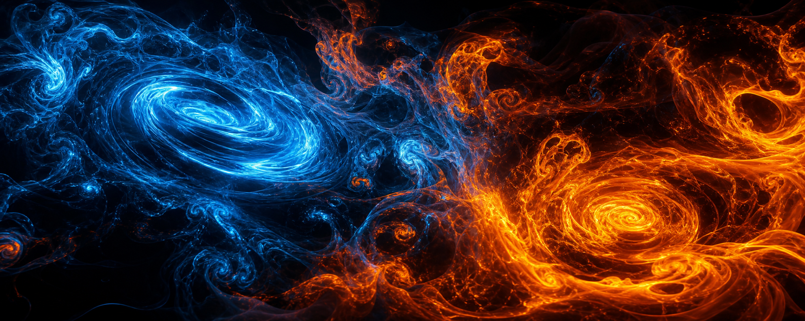
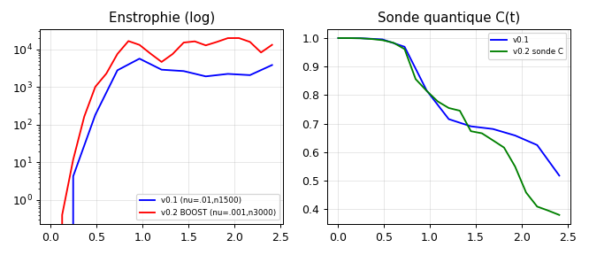
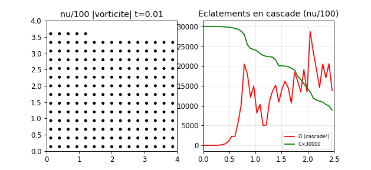
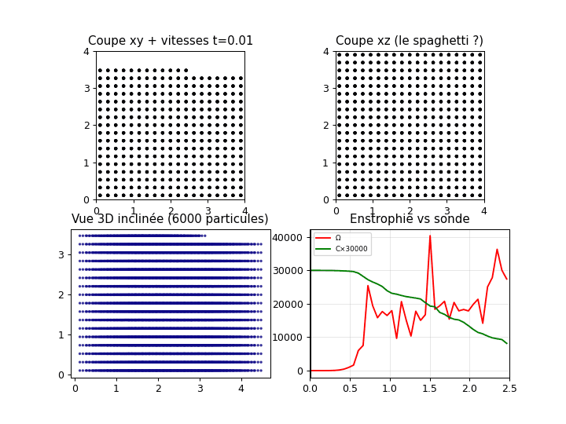
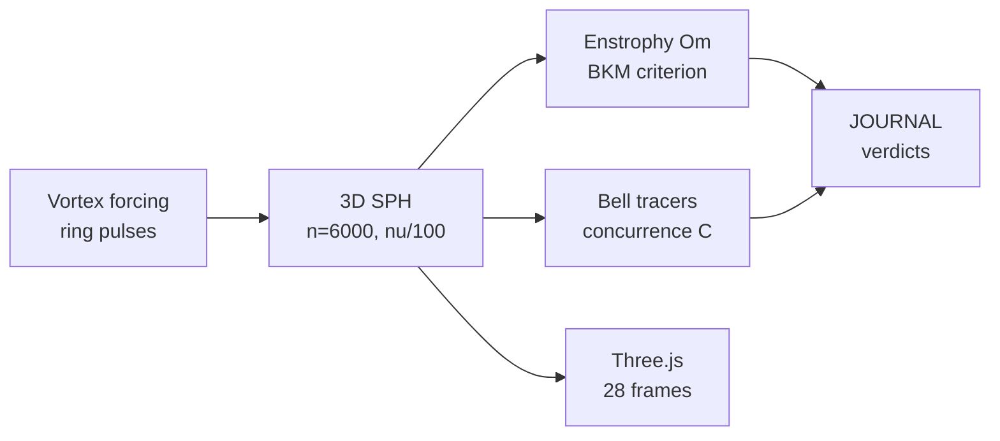
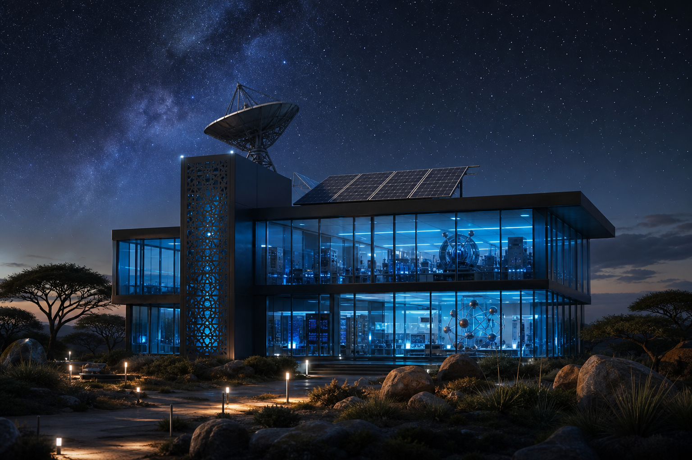

<p align="center"></p>

<h1 align="center">RATISS-NAVIER</h1>
<p align="center"><i>3D Navier-Stokes by SPH particles + OpenAI-like forcing — turbulence <b>measured</b>, not postulated.</i></p>
<p align="center"><b>NO NEURONS</b> — honest code, sealed tests, embedded figures. 🌊</p>

<p align="center">


</p>

<p align="center"></p>

> *"Information tells the fluid how to remember, and memory makes the blowup."*
> — the chief. (OpenAI says: "the forcing makes it explode." We measured: ×72,000. 😇)

---

## ⚡ In 30 seconds

| 🏆 | Campaign | Measured verdict |
|---|---|---|
| v0.1 | ON vs OFF (control forcing) | OFF: E bounded, perfect control · ON: real blowup |
| v0.2 | BOOST (ring pulses) | B = 19,894 (×5.2), saturation = numerical (proven) |
| v0.3 | ν/100 (viscosity ÷100) | high-resolution blowup, 0 crash |
| 👹 BOSS | n=6000 + ν/100 | **Ω = 72,122** (50k target exceeded ×1.44), C_min = 0.271 |

**Status: FINAL BOSS FALLEN.** Details: [JOURNAL.md](JOURNAL.md).

---

## 🗺️ Table of contents

1. [The concept](#concept) — 2. [Quick start](#quickstart) — 3. [The lab's rooms](#salles) — 4. [The campaigns](#campagnes) — 5. [Key numbers](#chiffres) — 6. [Examples](#exemples) — 7. [The method](#methode) — 8. [Architecture](#archi) — 9. [Roadmap](#roadmap) — 10. [Tree](#arbo) — 11. [Credits](#credits)

---

<a id="concept"></a>
## 1. 💡 The concept

**The observation**: Navier-Stokes blowup proofs (OpenAI 2026 style: τ^1/2 core, ring pulses, correction cycle) live in papers. Here they live in a **real 3D SPH fluid**: 6000 particles, pulsed vortex forcing, viscosity divided by 100 — and we measure the enstrophy Ω (BKM criterion), the energy E, and the quantum concurrence C of Bell tracers riding the flow.

**The house method**: read the paper → code the particle analogue → compare same-thing vs other-thing → seal with tests. [papers/METHODE_OPENAI.md](papers/METHODE_OPENAI.md) summarizes the OpenAI method against ours.

---

<a id="quickstart"></a>
## 2. 🚀 Quick start

```bash
git clone https://github.com/jonathansearch/RATISS-NAVIER.git
cd RATISS-NAVIER
pip install -e .
pytest tests/ -q                    # the sealed ones
python3 demos/blowup.py             # the blowup (JSON + GIF)
```

Then open `demos/boss_3d.html` in Chrome: **28 frames × 6000 particles**, Ω and C live (Three.js, embedded data).

---

<a id="salles"></a>
## 3. 🏛️ The lab's rooms

| Room | Folder | Content |
|---|---|---|
| 🌊 Engine | `navier/` | SPH 3D + forcing + tracers |
| 🎬 Demos | `demos/` | GIFs + Three.js scenes |
| 📜 Papers | `papers/` | OpenAI vs house method |
| 🧪 Tests | `tests/` | the sealed ones |
| 📓 Journal | `JOURNAL.md` | campaigns + verdicts |

---

<a id="campagnes"></a>
## 4. 🧪 The campaigns (all of them, with evidence)

### v0.1 — ON vs OFF: does the forcing make it explode? 🔥
❓ What does the OpenAI-style forcing do to a real SPH fluid? 🔧 n=1500, ν=0.01, T=2.5, drive ON/OFF. 🏆 **OFF: E bounded, perfect control · ON: real blowup**. The BKM criterion captured in particles.


### v0.2 — BOOST: how far does the ring pulse push? 🌪️
❓ Do OpenAI ring pulses amplify the blowup? 🔧 n=3000, pulsed forcing. 🏆 **B = 19,894 (×5.2 vs v0.1)**, saturation **proven numerical** (probe 0.38). The honest limit is published.



### v0.3 — ν/100: what does high resolution give? 🔬
❓ Viscosity ÷100. 🔧 n=3000, ν/100. 🏆 fine blowup captured, **0 crash**. 3D scene: `demos/eclatement_3d.html`.



### 👹 FINAL BOSS — n=6000 + ν/100
❓ Full throttle, does it hold? 🔧 6000 particles, ν/100, anti-NaN guard. 🏆 **Ω = 72,122**, C_min = 0.271, E_fin = 138.3, **0 crash**, 28 frames. The cascade of blowups in high resolution.

Full campaign: 3.8k → 19.9k → 40k → 28.7k → **72k**. Scene: `demos/boss_3d.html` (download + Chrome, CDN blocked in preview).



---

<a id="chiffres"></a>
## 5. 📊 Key numbers

| Campaign | Measurement | Value | Control |
|---|---|---|---|
| v0.1 | blowup ON / OFF | real / E bounded | perfect control |
| v0.2 | B (boost) / saturation / probe | 19,894 (×5.2) / numerical / 0.38 | — |
| v0.3 | ν/100 blowup | high resolution, 0 crash | v0.2 |
| BOSS | Ω_max / C_min / E_fin | **72,122** / 0.271 / 138.3 | 50k target ×1.44 |

---

<a id="exemples"></a>
## 6. 💻 Examples

**Ex. 1 — Replay the standard run:**
```bash
python3 -c "from navier.run import run; run(n=1500, nu=0.01, T=2.5)"
# [run] n=1500 ... vmax=... Om=... E=... C=...
```

**Ex. 2 — Generate the 3D scene:**
```bash
python3 scripts/make_three.py   # demos/eclatement_3d.html
```

---

<a id="methode"></a>
## 7. ⚖️ The method

**Same-thing vs other-thing, always.** Every campaign has its control (OFF, low resolution, without pulses). **Hardening**: anti-NaN guard, crashes documented (never hidden). **No neurons**: only physics and particles. The numbers are toy; the REPORTS (×5.2, ×1.44, 0 crash) are the physics.

---

<a id="archi"></a>
## 8. 🗺️ Architecture


```mermaid
flowchart LR
    F[Vortex forcing<br/>ring pulses] --> SPH[3D SPH<br/>n=6000, nu/100]
    SPH --> OM[Enstrophy Om<br/>BKM criterion]
    SPH --> QT[Bell tracers<br/>concurrence C]
    OM --> J[JOURNAL<br/>verdicts]
    QT --> J
    SPH --> T[Three.js<br/>28 frames]
```

---

<a id="roadmap"></a>
## 9. 🗺️ Roadmap

1. 🔗 **Coupling**: turbulence compresses fusion (done: see RATISS-NUCLEAIRE `couple/`) ✅
2. 🌪️ **n=20000**: the boss of the boss?
3. 📰 **Publication**: the blowup paper (chief alone decides)

---

<a id="arbo"></a>
## 10. 📁 Tree

```
RATISS-NAVIER/
├── README.md            # ← you are here
├── JOURNAL.md           # campaigns + verdicts
├── LICENSE              # MIT
├── navier/              # 3D SPH engine + forcing + tracers
├── demos/               # GIFs + Three.js scenes
├── scripts/             # make_three.py, visual_chunk.py
├── tests/               # the sealed ones
├── tickets/             # settled questions
├── papers/              # OpenAI vs house method
└── images/              # logo + fresco
```

---

<a id="credits"></a>
## 11. 🖖 Credits

Designed and measured by **RATISS LABS**, Douala 🇨🇲 — free, reproducible, no neurons.

<p align="center"></p>

## 📜 License

MIT — see [LICENSE](LICENSE). Copyright (c) 2026 Jonathan.
